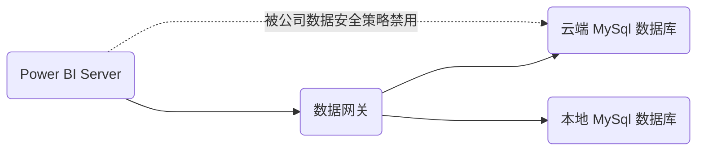
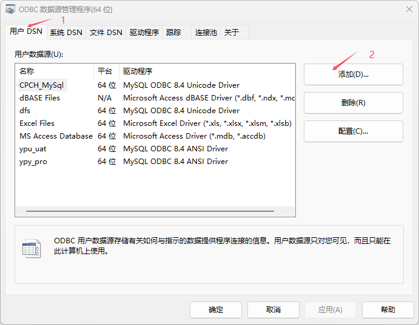
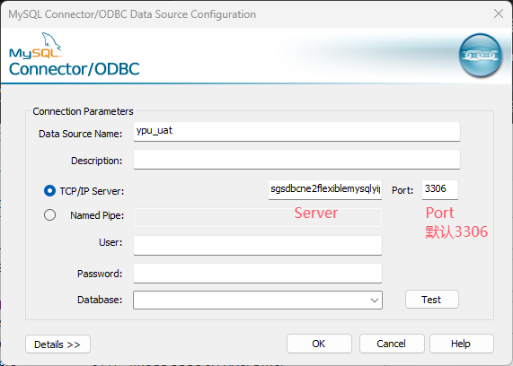
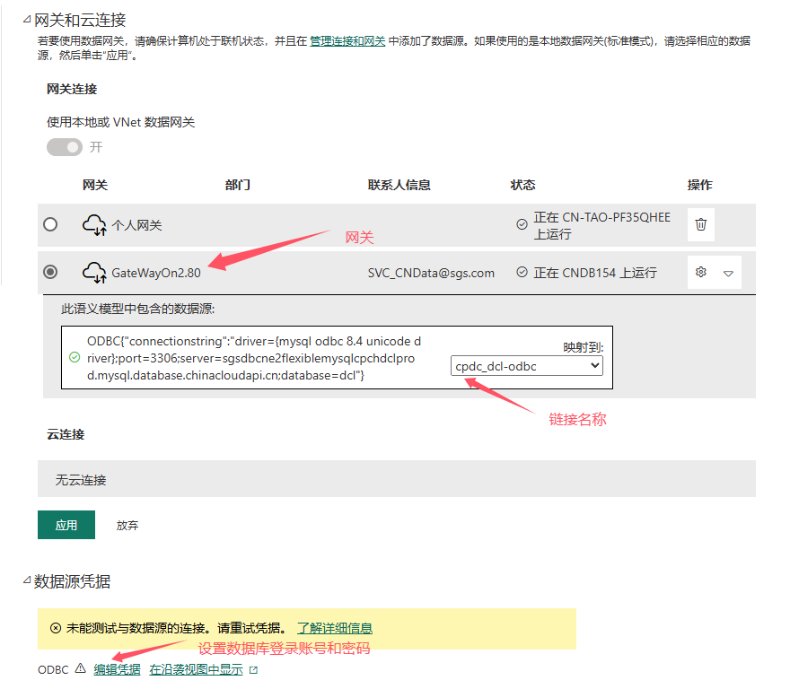

# 
Power BI 链接MySql 数据库

## 问题点
1. 如何使用Power BI Desktop 链接到MySql数据库;
2. Power BI 报表上传到Power BI Service 后，如何链接到MySql数据库进行数据刷新；

## 概述
Power BI Server 链接MySql的三种方式:
* ~~通过云端连接MySql;~~
* 使用数据网关连接MySql;
    * 通过Connector/NET 连接MySql;
    * 通过Connector/ODBC 连接MySql;

## 通过云端连接MySql
> [!NOTE] 
> 由于公司数据安全策略， MySql数据库只能通公司内网访问。因此Power BI Server 不能直接链接到MySql数据库。因此，我们需要通过数据网关的方式来连接MySql数据库，完成Power BI报表的日常刷新。

## 使用数据网关连接MySql
> [!IMPORTANT]
> 使用数据网关连接MySql，需要联系 Charles 创建数据链接。 
> 验证数据链接可以正常刷新数据后，再开始制作报表。

### 通过Connector/ODBC 连接MySql 【Local IT 推荐】

#### Power BI Desktop 链接MySql数据库步骤：
1. 在本地安装MySql ODBC驱动；
    * [MySql Connector ODBC驱动 下载地址](https://dev.mysql.com/downloads/connector/odbc/)；
    * 驱动安装需要管理员权限，需要联系Local IT 帮忙安装。

2. 创建数据源（DSN）；
    1. 在“开始”菜单中搜索“ODBC 数据源 (64 位)”应用程序；
    2. 选择“系统 DSN”选项卡，点击“添加”；
        
    3. 选择“MySQL ODBC 8.0 Unicode Driver”驱动，点击“完成”；
    4. 在弹出的窗口中，填写数据库连接信息；
        
3. 在Power BI Desktop 中，选择“获取数据”->“更多”，找到【ODBC】驱动；
4. 选择刚才创建的DSN，点击“确定”；
    
    > [!TIP]
    > 使用连接字符串连接MySql数据库时，【数据源名称DSN】选择无； 
    > 高级选购中，使用SQL语句筛选数据，可以减少导入数据量。 例如：`SELECT * FROM TableName WHERE ColumnName = 'Value'`；
5. 选择要加载的表，点击“加载”；

#### Power BI Service 配置数据网关刷新任务步骤：
1. 将Power BI 报表发布到 Power BI Service;
2. 联系 Charles 创建数据链接；
3. 进入语义模型设置，选择【网关】和【连接名称】
     
4. 配置数据源凭据；
5. 尝试刷新语义模型。

### 通过Connector/NET 连接MySql 
> [!NOTE]
> 使用 Connector/NET 驱动连接MySql数据库，可能会遇到一些兼容性问题。例如，在Power BI Desktop 中可以正常连接MySql数据库，但是在 Power BI Service 上刷新数据时可能会报错。因此，推荐使用Connector/ODBC 驱动连接MySql数据库。

#### Power BI Desktop 链接MySql数据库步骤：
1. 在本地安装MySql Connector/NET驱动；
    * [MySql Connector/NET驱动 下载地址](https://dev.mysql.com/downloads/connector/net/)；
    * 驱动安装需要管理员权限，需要联系Local IT 帮忙安装
2. 在Power BI Desktop 中，选择“获取数据”->“更多”，找到【MySQL 数据库】驱动；
3. 设置MySQL数据库的服务器和数据库后，点击确定；
    > [!TIP]
    > 高级选购中，使用SQL语句筛选数据，可以减少导入数据量。 例如：`SELECT * FROM TableName WHERE ColumnName = 'Value'`；
4. 选择要加载的表，点击“加载”；

#### Power BI Service 配置数据网关刷新任务步骤：
1. 将Power BI 报表发布到 Power BI Service;
2. 联系 Charles 创建数据链接；
3. 进入语义模型设置，选择【网关】和【连接名称】
     
4. 配置数据源凭据；
5. 尝试刷新语义模型。

### 参考链接
* [Power Query ODBC 连接器](https://learn.microsoft.com/zh-cn/power-query/connectors/odbc)
* [Power Query MySQL 数据库 连接器](https://learn.microsoft.com/zh-cn/power-query/connectors/mysql-database)
* [MySQL Community Downloads](https://dev.mysql.com/downloads/)
